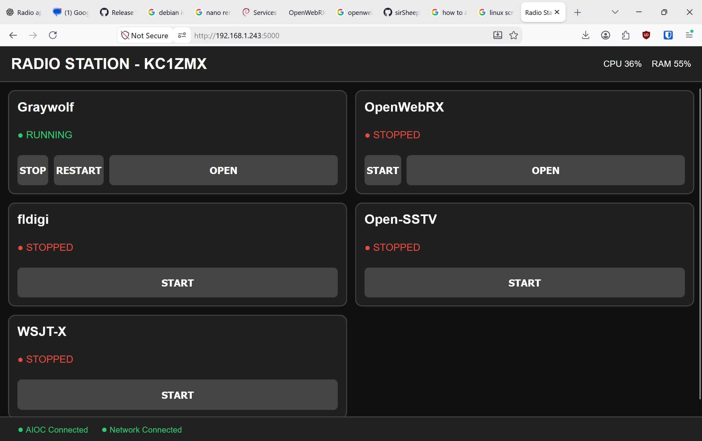

# Radio Station Dashboard

A lightweight touchscreen dashboard for managing and monitoring a personal amateur radio station running Debian.

The dashboard provides a simple interface for starting and stopping headless radio services, launching local GUI applications, monitoring application status, and displaying basic system and radio-interface status.

It is designed around an **800×600 touchscreen** (ah the joys of salvaging old equipment), but can be used from any web browser on the local network.

## Features

* Touchscreen-friendly web interface
* Designed for 800×600 displays
* Application status monitoring
* Automatic status updates without page reloads
* CPU and memory monitoring
* Network connection status
* AIOC USB connection status
* Start/stop/restart support for systemd services
* Direct launching of local GUI applications
* Detection of GUI applications that were launched or closed manually
* Web interface links for applications that provide a web UI
* Station callsign displayed in the dashboard
* YAML-based configuration
* systemd service for automatic dashboard startup
* Interactive installation and uninstallation scripts
* No database required

# AI Warning

Despite everything, I sheepishly admit that **ChatGPT was used** during the development of this project for software design, troubleshooting, configuration, documentation, and development assistance.


## Architecture

The dashboard distinguishes between two types of applications.

### Services

Headless applications that run as systemd services.

Examples:

* Graywolf
* OpenWebRX

The dashboard can:

* Start the service
* Stop the service
* Restart the service
* Display the current service status
* Open the application's web interface

### Local Applications

GUI applications that run directly on the physical Debian desktop.

Examples:

* fldigi
* Open-SSTV
* WSJT-X

These applications are launched directly into the user's graphical session.

The dashboard intentionally **does not stop or restart GUI applications**. Once launched, they are closed manually from their own application window. The dashboard monitors their process status and updates the interface automatically.

This avoids using VNC/noVNC or additional desktop-session wrappers.

---

# Installation

## Requirements

The dashboard is intended for a Debian-based Linux system with:

* Python 3
* systemd
* A graphical desktop session if local GUI applications are being used
* An X11 display for GUI application launching

The dashboard itself does not require the radio hardware to be connected.

## Quick Install

Clone the repository:

```bash
git clone https://github.com/sirSheepDog/radio-dashboard.git
```

Enter the directory:

```bash
cd radio-dashboard
```

Run the installer:

```bash
sudo ./install.sh
```

The installer will ask for:

```text
Linux username [pi]:
Server host [0.0.0.0]:
Server port [5000]:
```

Press **Enter** to accept the defaults.

The installer will:

1. Install the required Debian Python packages.
2. Create `/opt/radio-dashboard`.
3. Create a Python virtual environment.
4. Install the Python dependencies.
5. Copy the dashboard files.
6. Create the dashboard configuration.
7. Create a systemd service.
8. Enable the service at boot.
9. Start the dashboard.

After installation, the dashboard will normally be available at:

```text
http://localhost:5000
```

If the server host is configured as `0.0.0.0`, it can also be accessed from another computer on the same network using the Debian machine's IP address.

---

# Configuration

Configuration files are stored in:

```text
/opt/radio-dashboard/config/
```

There are three primary configuration files.

## Station Configuration

```text
config/station.yaml
```

Example:

```yaml
callsign: XXXXXX
```

The callsign is displayed at the top of the dashboard:

```text
RADIO STATION - XXXXXX
```

A template is provided as:

```text
config/station.yaml.example
```

---

## Dashboard Configuration

```text
config/dashboard.yaml
```

Example:

```yaml
user: pi

server:
  host: 0.0.0.0
  port: 5000
```

### `user`

The Linux user running the graphical desktop session.

This is particularly important for local GUI applications because the dashboard needs to launch them into the correct X11 session.

### `server.host`

Controls which network interface Flask listens on.

For access from the local machine only:

```yaml
server:
  host: 127.0.0.1
```

For access from other devices on the local network:

```yaml
server:
  host: 0.0.0.0
```

### `server.port`

Controls the TCP port used by the dashboard.

For example:

```yaml
server:
  port: 5000
```

---

## Application Configuration

```text
config/applications.yaml
```

This defines the applications displayed by the dashboard.

Applications can be configured as either `service` or `local`.

### Example service

```yaml
- name: OpenWebRX
  id: openwebrx
  type: service

  service:
    name: openwebrx.service

  interface:
    type: web
    url: http://localhost:8073
    qr: true
```

### Example local application

```yaml
- name: fldigi
  id: fldigi
  type: local

  launch:
    command:
      - /usr/bin/fldigi
    process: /usr/bin/fldigi

  interface:
    type: local
    qr: false
```

This configuration-driven approach makes it possible to add applications without modifying the dashboard interface itself.

---

# Managing the Dashboard Service

Check the dashboard status:

```bash
systemctl status radio-dashboard
```

Start it:

```bash
sudo systemctl start radio-dashboard
```

Stop it:

```bash
sudo systemctl stop radio-dashboard
```

Restart it:

```bash
sudo systemctl restart radio-dashboard
```

View live logs:

```bash
journalctl -u radio-dashboard -f
```

Enable it at boot:

```bash
sudo systemctl enable radio-dashboard
```

Disable it at boot:

```bash
sudo systemctl disable radio-dashboard
```

---

# Updating the Dashboard

If the dashboard was installed from the Git repository, update the source:

```bash
cd radio-dashboard
git pull
```

Then reinstall:

```bash
sudo ./install.sh
```

The installer will recreate the installed version under:

```text
/opt/radio-dashboard
```

and restart the dashboard service.

## Configuration During Updates

The installer preserves the station configuration when a local:

```text
config/station.yaml
```

exists.

The installer also generates:

```text
config/dashboard.yaml
```

from the installation settings.

If you have customized your application configuration, review `config/applications.yaml` before reinstalling.

---

# Uninstallation

To completely remove the installed dashboard:

```bash
cd radio-dashboard
sudo ./uninstall.sh
```

The uninstaller removes:

* The `radio-dashboard` systemd service
* The `/opt/radio-dashboard` installation
* The Python virtual environment
* Installed dashboard files

It does **not** remove Debian Python packages because they may be used by other software.

It also does not modify external radio applications or their systemd services.

The development/Git repository in your home directory is not removed.

---

# Radio Applications

The dashboard itself does not install or configure radio applications.

Applications such as the following can be integrated through `applications.yaml`:

* Graywolf
* OpenWebRX
* fldigi
* Open-SSTV
* WSJT-X

Each application should be installed and tested independently before adding it to the dashboard.

---

# Hardware Testing

The dashboard and associated radio-station setup have been tested with:

* **AIOC — All In One Cable**
* **TIDRADIO H8**

The AIOC is detected by the dashboard through its USB vendor/product identification.

The dashboard does not directly implement the radio protocol. Radio communication is handled by the individual applications and their configured audio/PTT interfaces.

---

# Development

The dashboard is intentionally built using a small number of dependencies:

* Python
* Flask
* PyYAML
* psutil
* HTML/CSS/JavaScript
* systemd

The goal is to keep the project lightweight and easy to modify for different amateur radio stations and hardware configurations.

The application configuration is intentionally separated from the dashboard code so additional applications can be added without requiring changes to the main interface.

---

# License

This project is licensed under the **GNU Affero General Public License v3.0 (AGPL-3.0)**.

You should receive a copy of the GNU Affero General Public License along with this program. If not, see the official GNU project website for the license text.


---
